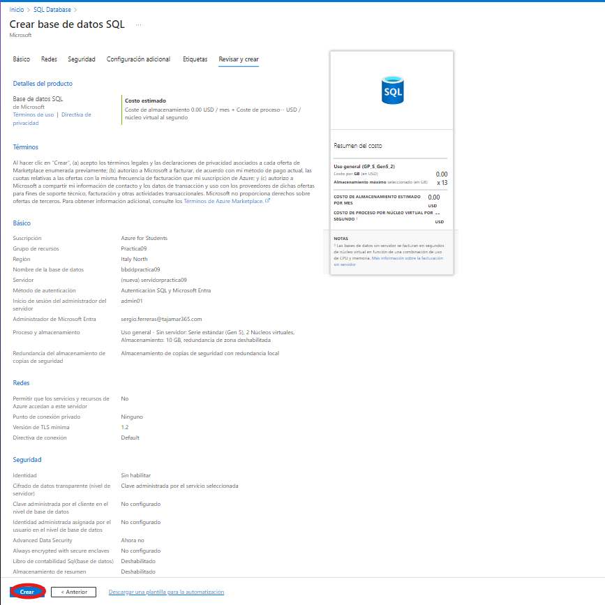
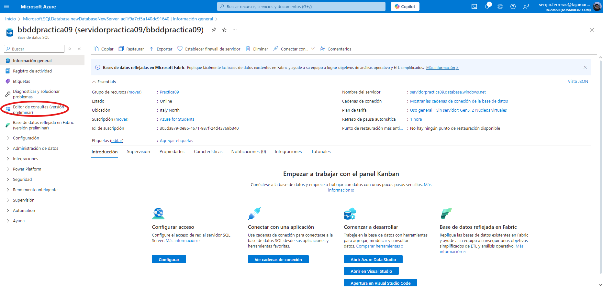
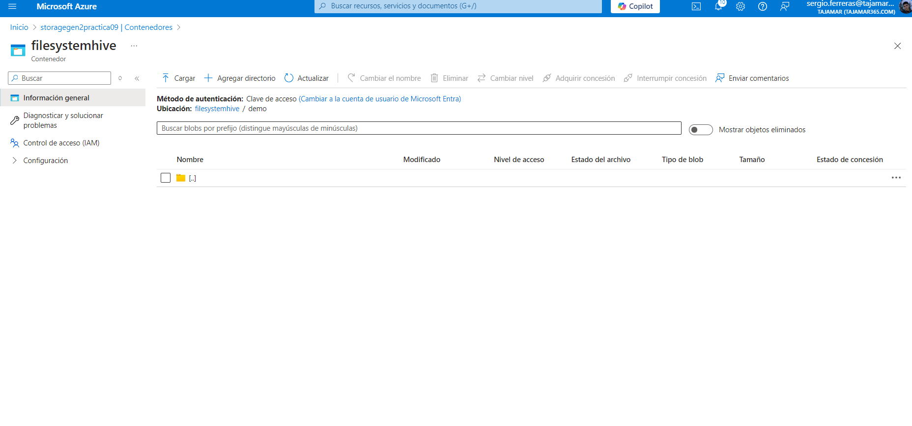
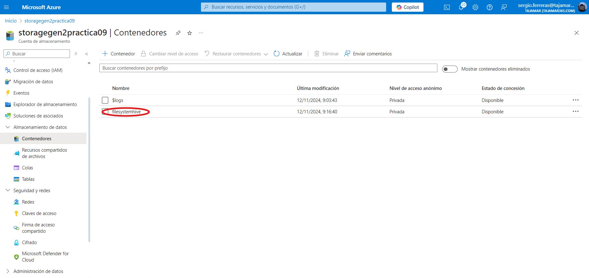

# Solucion ETL con Hadoop en Azure
## ¿Que servicios se usan?:
Los servicios que se usaran para la Solucion ETL para batch precesssing con Hadoop en ambiente Azure, usara los servicios HDInsights + Azure Data Lake Storage Gen 2 + HIVE + SQL Database + Sqoop

## Pasos:
Estos son los paso que hay que seguir para realizar esta solucion.

### Crear un grupo de recursos:
Entramos en crear recurso

Buscamos "Grupos de recursos"

Pulsamos nuevo

Creamos el grupo de recursos poniendo un nombre y localizacion, en este caso Norte de Italia:

Pulsamos Revisar y Crear y pulsamos el boton de crear:

Comprobamos que este creado el grupo de recursos:

### Crear Source: Azure Data Lake Store Gen 2
#### Creacion Storage Account:
Empezamos por la Storage Account:

Buscamos Cuentas de Almacenamiento y clickamos:

Creamos una nueva cuenta de almacenamiento:

Rellenamos con esta info:

Pulsamos siguiente:

Pulsamos siguiente:

Pulsamos siguiente:

Tags lo podemos dejar en blanco, asique pulsamos siguiente:

Pulsamos revisar y crear y click en crear:

### Creacion SQL Server
Ahora crearemos el servicio de SQL Server que es donde se de destianaran los datos

Buscamos SQL Database:

Una vez dentro, hacemos click en crear:

Rellena el grupo de recursos, el nombre de la BBDD y crea un nuevo servidor:

Crea el servidor con los siguientes datos:
- Nombre de servidoor: servidorpractica09
- Ubicacion: ``Norte Italia``
- Metodo de Autenticicacion: ``Uso de la autenticicacion de SQL y Microsoft Entra``
- Usuario: ``admin01``
- Contraseña: ``alumno1234?``

Despues de esto, pulsamos `Establecer Administrador`
Buscamos nuestro email correspondiente con nuestra cuenta de estudiante y seleccionamos

Queda algo similar a esto y pulsamos aceptar

Una vez pulsemos aceptar, revisamos que quede el apartado `Crear base de datos`  de esta manera

Pulsamos en el apartado proceso y almacenamiento configurar base de datos

Configuramos la BBDD como en la imagen y pulsamos aplicar

Despues de configurar la BBDD, pulsamos en el apartado Redes

Pulsamos siguiente:

Pulsamos siguientes:

Pulsamos siguiente:

Pulsamos siguiente, lo podemos dejar en blanco:

Pulsamos crear y esperamos a la implementacion:

Una vez implementado, pulsamos ir al recurso:

Despues vamos a editor de consultas:

Nos saldra un error:

Para arreglar el error, salimos a home y pulsamos en todos los recursos:

Pulsamos en servidorpractica09 ``SQL server`` y dentro pulsamos en seguridad>redes:

Pulsamos en redes seleccionadas y en reglas de firewall, pulsamos en agregar direccion IPv4 del cliente:

Nos saldra esto:

Si nos da error pulsamos agregar una regla de firewall:

Escribimos nuestra IP a mano y le ponemos nombre
- Nombre: miIP
- IP inicial: 72.14.201.63
- IP final: 72.14.201.65

Pulsamos guardar:

Despues de esto volvemos SQL database en editor de consultas y pulsamos continuar como sergio.ferreras@tajamar365.com:

Como no funcionaraes pulsamos 188.26.212.189 IP.... ``(Texto azul de arriba)``

Ahora si volvemos a pulsar continuar como sergio.ferreras@tajamar365.com:

### Añadir Managed Identity 
Añadimos Managed Identity a Gen2 y a DataBase. ¿Cual es el proposito de usar Managed Identity?
Para ello buscamos Identidades Administradas y lo pulsamos:

Ahora hacemos click en crear:

Seleccionamos
- Grupo de Recursos: ``Practica09``
- Region: ``Italy North``
- Nombre: ``mi-practica09``
y pulsamos siguiente

Las etiquetas las podemos dejar en blanco, pulsamos en siguiente:

Y ahora pulsamos crear y esperamos a que se implemente:

Ahora volvemos a home>Recursos y buscamos storagegen2preactica09 y pulsamos en el:

Despues vamos a Control de acceso (IAM):

Hacemos click en agregar y acto seguido a asignacion de roles:

Buscamos en la barra ``Propietario de datos de Storage Blob`` y lo seleccionamos, despues pulsaremos siguiente:

En la pestaña miembros, seleccionaremos Identidad administrada y despues seleccionar miembros:

El la seleccion de identidades administrads, seleccionamos ``identidad administrada asignada por el usuario`` y seleccionamos en este caso ``mi-practica09``:

Despues pulsamos seleccionar

Hacemos click en siguiente:

Condiciones las dejamos como aparecen por defecto:

Por ultimo pulsamos en el apartado Revision y Asignacion abajo el boton que pone Revisar y Asignar:

Nos sacara a la pagina de antes

Volvemos a home y buscamos servidorpractica09:

Ahora pulsamos en ``acceso control (IAM)``:

Hacemos click en agregar y acto seguido a asignacion de roles:

Buscamos en la barra de busqueda ``Colaborador de SQL Server`` y lo seleccionamos, pulsamos siguiente:

Seleccionamos identidad administrada y despues en seleccionar miembros:
 
En la seleccion de miembros, ponemos en identidad administrada ``Identidad administrada asignada por el usuario`` y seleccionamos mi-practica09 y por ultimo clickamos seleccionar:
 
Hacemos click en siguiente:

Hacemos click en Revisar y asignar:

Ahora volvemos a home y buscamos ``Clústeres de HDInsights``:

Ahora pulsamos crear:

Ponemos los datos como la imagen, con el 
- Grupo de recursos ``Practica09``
- Nombre del Clúster: ``clusterpractica09``
- Region: ``Italy North``

Para arreglar el error que sale pulsamos click en ``Haga click aqui para realizar un registro...``

En el buscador ponemos ``HDInsight`` y lo seleccionamos y pulsamos registrarse:

Esperamos y despues de que estemos registrados volvemos a la pestaña ``Crear Clúster`` y veremos que ahora si funciona, despues pulsamos ``seleccionar tipo de cluster``:

Seleccionamos ``Interactive Query``:

La primera parte se deberia de ver asi:

Ahora asignamos el login y password para el Clúster, en mi caso
- Nombre de usuario: ``admin01``
- Contraseña: ``Alumno1234?``
Luego, pulsamos siguiente:

En almacenamiento, seleccionamos lo siguiente y ponemos de nombre de sistema de archivos ``filesystemhive``:

En el apartado de Identidad, seleccionamos ``mi-practica09`` y lo demas en blanco, despues pulsamos siguiente:

El primer apartado se queda por defecto sin tocar nada:

En el segundo apartado lo dejamos como en la siguiente imagen, y despues pulsamos siguiente:

Nos saldra que la cuota es muy alta, para arreglarlo, cambiamos el nodo ``trabajador`` su valor 4 por 1 (En esta parte, puede dar un fallo en el que te diga que no has seleccionado ningun clúster, si pasa eso cambia de zona a una que sea mejor) despues de cambiarlo , te dejara continuar, pulsa siguiente:

Lo dejamos todo como viene por defecto y pulsamos siguiente:

Pulsamos crerar, dependiendo de la conexion que tengamos tardara mas o menos, (Es posible que nos de un error debido a un error del nombre del clúster, si es asi, lo que hay que hacer es cambiarlo, para no liarnos añade letras repetidas como: ``clusteer``):

Despues de un rato, se creará:

### Ingestion de Datos
Una vez hallamos terminado los pasos anteriores, ingestaremos nuestros datos al Data Lake Storage, descargaremos nuestro archivo csv que se llama ``FlightDelayData.csv`` (Se encuentra en este repositorio).
En Azure, nos vamos a ``storagegen2practica09`` y hacemos click en ``Data Lake Storage ``.

Ahora hacemos click en ``Explorador de almacenamiento``:

Haz click en contenedores de Blob:

Y ahora en ``filesystemhive``:

Una vez dentro pulsamos ``Agregar directorio``:

Ahora creamos carpeta con el nombre de ``demo``:

Buscamos la carpeta ``demo`` y nos situamos en ella:

Ahora creamos la carpeta ``FlightDelayData``:

Ahora entramos en la carpeta ``FlightDelayData`` y creamos una carpeta con el nombre `` InputData``:

Ahora creamos una carpeta con el nombre `` output``:

Ahora entramos en ``InputData`` y cargamos el archivo `` FlightDelayData.csv``:

Subimos el archivo:

Si lo has seleccionado, ya estara subido, pulsa cargar:

### Data Extraction con Hive
Volvemos al menú home y hacemos click en nuestro cluster:

Una vez dentro pulsamos ``Inicio de Ambari``:

Nos pedira la creedenciales que escribimos cuando levantamos el clusteer, en este caso son:
- Nombre de usuario: ``admin01``
- Contraseña: ``Alumno1234?``

Una vez dentro pulsamos los 9 cuadraditos azules:

Escogemos Hive View 2.0:

De forma automatica validara el cluster:

Despues de validar el cluster, se nos mostrara el editor de queries de Hive:

Ahora copiaremos y pegaremos el contenido del fichero ``query-1.txt`` esta en este mismo repositorio y pulsamos ``Execute``:

Despues vamos al apartado tables para comprobar que se ha ejecutado todo correctamente:

Volvemos a Query y pulsanro ``+`` abrimos un nuevo worksheet:

Dentro del nuevo worksheet, hacemos una consulta como puede ser ``select * from flightdelay limit 5;`` y pulsamos el boton ``execute``:

El resultado de la consulta se ve abajo en results:

(Puede dar un error en esta parte, porque crea otra ruta demo/..., si es asi carga en los dos demos el csv)
En esta sección hemos realizado una ingestión desde Data Lake Storage Gen 2 hasta un lugar dentro del cluster utilizando T-SQL mediante Hive.
### Data Transformation con Hive
Abrimos un nuevo worksheet y ejecutamos la siguiente query ``(query-3.txt)`` archivo que se encuentra en este repositorio:

¿Que hace ``(query-3.txt)`` ?
El código SQL selecciona el nombre de la ciudad de origen y el promedio de los retrasos por clima de la tabla flightdelay, eliminando las comillas simples del nombre de la ciudad y filtrando los registros con retrasos por clima no nulos. Luego, agrupa los resultados por ciudad de origen y los guarda en un archivo CSV en el directorio especificado (/demo/FlightDelayData/output), con los campos separados por comas.

Ahora volvemos a Azure a storagegen2practica09 y ahcemos Click en containers y luego click a filesystemhive:

Navegaremos hasta el output, para ello selecciona demo:

Ahora entra en ``FlightDelayData``:

Y por ultimo en output:

Veremos la carpeta output (la creara si no existe), dentro veremos los resultados:

### Data Export mediante Sqoop
Esta parte de aqui no funciona, es por eso por lo que no esta explicada